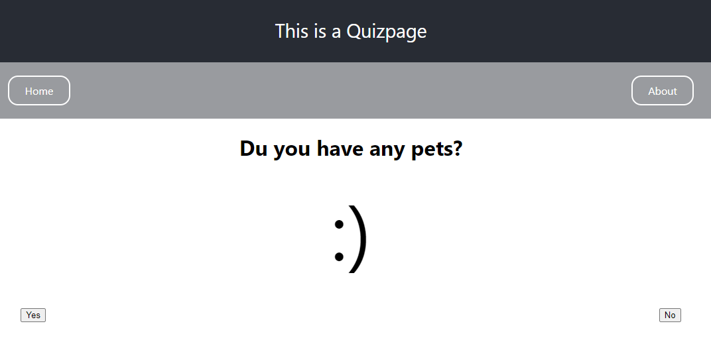
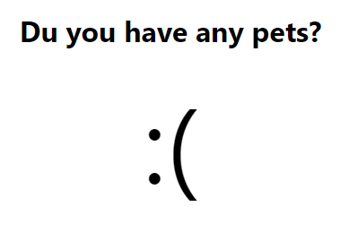

    <h1>React assignment by Veronica Sjöquist</h1>
    
On the first page of the app there's a big header that welcomes to the page. Below the header is a form then a bold line to separate the navbar. The form arks you to input your name and there's an "enter" button.

    
    
If you enter a name in the form it changes the header and the doc-title(tab) to what you put in. This is done with useState hooks and also a useEffect for the doc-title.

    
    
On the quizpage there's a smaller header on the top and below that is the navbar in a faded colour and the main part of the page is white. The page is asking the user if they have any pets and displays a happy face and there's buttons "yes" and "no".

    
    
If the user presses the "no" button the smiley changes to a sad face and if the "yes" button is pressed the happy face displays. This is done with a useState hook.

    
    
The aboutpage has the same basic layout as the quizpage. It displays the names and pictures of my pets.

    
    
Below each picture is a button to toggle the description, cat or dog. This is done with a useState hook. The colour of the description text is a prop passed down two levels.

    

